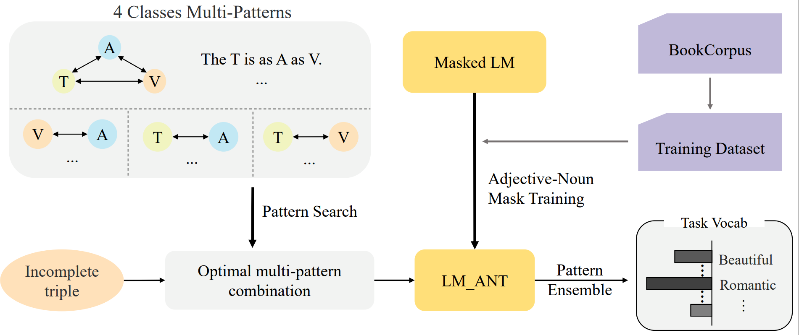

# Probing Simile Knowledge from Pre-trained Language Models
This repository contains the data, codes and model checkpoints for our paper ["Probing Simile Knowledge from Pre-trained Language Models"](https://aclanthology.org/2022.acl-long.404/).   

## Overview
The simile interpretation (SI) task and the simile generation (SG) task can be unified into the form of Simile Triple Completion (STC) as shown in the following figure.

In this paper, we probe simile knowledge from PLMs to solve the simile interpretation (SI) and simile generation (SG) tasks in the unified framework of simile triple completion for the first time. The framework of our method as shown in the following figure.

## Adjective-Noun mask Training (ANT)
We apply a secondary pre-training stage (the adjective-noun mask training) to improve the diversity of predicted words.

First, we utilize [trankit](https://github.com/nlp-uoregon/trankit) to construct the training set by selecting sentences from BookCorpus that contains *amod* dependencies. The extracted sentences are uploaded to [Google Drive](https://drive.google.com/file/d/1zKLYGkVTLkrGMJJEgvsTZNNAHO8u6ER7/view?usp=sharing).

Second, we mask a word at the end of *amod* relation, instead of randomly masking, and all words are masked no more than *5* times. The constructed dataset are uploaded to [Google Drive](https://drive.google.com/file/d/1EHo61afA2FrfJCZRN4i4EvbR9cJNZgPt/view?usp=sharing).

Finally, the PLM is finetuned on the constructed dataset with MLM loss. You can import our finetuned model [nairoj/Bert_ANT](https://huggingface.co/nairoj/Bert_ANT) by using [HuggingFace's Transformers](https://github.com/huggingface/transformers). 

## Simile Triple Completion
Our method of SI and SG are shown in this [Colab Script]().

